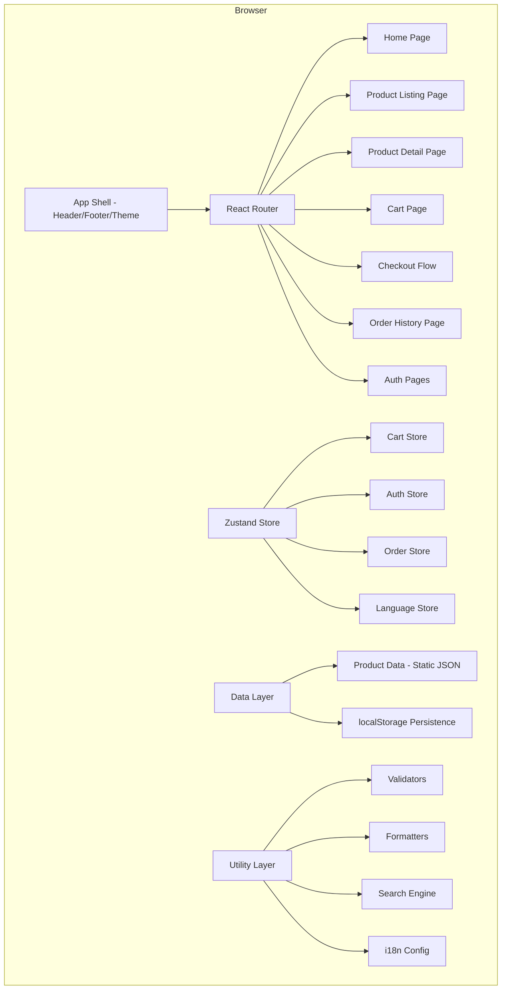

# Design Document: 카타콤 (Catacomb) - K-POP & K-WEBTOON Goods Shop

## Overview

카타콤 (Catacomb) is a single-page application (SPA) demo e-commerce site for K-POP and K-WEBTOON merchandise. The application runs entirely in the browser with no backend server — all data is stored in-memory with localStorage persistence for session state. This approach simplifies deployment (static hosting) while demonstrating a full shopping flow.

### Key Design Decisions

1. **React + TypeScript**: Chosen for component-based UI, strong typing, and wide ecosystem support for e-commerce patterns.
2. **Client-side only**: No backend needed for a demo — product data is generated at build time, cart/order state lives in localStorage.
3. **React Router**: Handles SPA navigation for product listings, detail pages, cart, checkout, and order history.
4. **Zustand**: Lightweight state management for cart, user session, and order state — simpler than Redux for this scope.
5. **CSS Modules + CSS Custom Properties**: Blue theme via design tokens, scoped styles per component, no external UI framework dependency.
6. **Vite**: Fast build tool with HMR for development and optimized static builds for production.
7. **i18next**: Established i18n library for bilingual (Korean/English) support with React integration via react-i18next.

## Architecture



### Architectural Layers

1. **Presentation Layer**: React components organized by page/feature, styled with CSS Modules. Each page component handles its own layout and delegates data fetching to the data layer.
2. **State Layer**: Zustand stores managing cart, auth, orders, and language preferences. Each store uses `persist` middleware to sync with localStorage.
3. **Data Layer**: Static product data (generated at build time), search/filter/sort utilities as pure functions. All product operations are synchronous in-memory lookups.
4. **Utility Layer**: Pure validation functions (Luhn check, email validation, form validation), formatters (currency, date), and i18n configuration. These are the primary targets for property-based testing.

### Folder Structure

```
src/
├── components/          # Shared UI components
│   ├── layout/          # Header, Footer, AppShell
│   ├── product/         # ProductCard, ProductGrid, Pagination
│   ├── cart/            # CartItemRow, CartSummary
│   ├── checkout/        # StepIndicator, ShippingForm, PaymentForm
│   └── common/          # LanguageToggle, SearchBar, CategoryMenu
├── pages/               # Route-level page components
├── stores/              # Zustand stores (cart, auth, order, language)
├── data/                # Static product data and generators
├── utils/               # Pure utility functions
│   ├── validators.ts    # Email, password, Luhn, CVV, card expiry
│   ├── formatters.ts    # Currency, date formatting
│   ├── search.ts        # Product search/filter logic
│   └── pagination.ts    # Pagination utilities
├── i18n/                # Translation files (ko.json, en.json)
├── styles/              # Global styles and CSS custom properties
└── types/               # TypeScript type definitions
```

## Components and Interfaces

### Page Components

| Component | Route | Description |
|-----------|-------|-------------|
| `HomePage` | `/` | Hero banner, featured products, category links |
| `ProductListingPage` | `/category/:mainCategory/:subCategory?` | Product grid with pagination, sorting |
| `ProductDetailPage` | `/product/:productId` | Full product info, add-to-cart |
| `SearchResultsPage` | `/search?q=:query` | Search results grid with pagination |
| `CartPage` | `/cart` | Cart items, quantity management, checkout button |
| `CheckoutPage` | `/checkout` | Multi-step: shipping → payment → confirmation |
| `OrderHistoryPage` | `/orders` | List of past orders |
| `OrderDetailPage` | `/orders/:orderId` | Single order details with reorder |
| `LoginPage` | `/login` | Login form (pre-filled in demo) |
| `RegisterPage` | `/register` | Registration form |

### Shared Components

```typescript
// Layout
interface AppShellProps {
  children: React.ReactNode;
}

interface HeaderProps {
  cartItemCount: number;
  userName: string | null;
  currentLanguage: 'ko' | 'en';
  onLogout: () => void;
  onLanguageToggle: () => void;
}

interface FooterProps {}

// Navigation
interface CategoryMenuProps {
  categories: Category[];
  onSubCategorySelect: (mainCategory: string, subCategory: string) => void;
}

interface SubMenuPanelProps {
  category: Category;
  isVisible: boolean;
  onClose: () => void;
}

// Product Display
interface ProductCardProps {
  product: Product;
  onAddToCart: (productId: string) => void;
}

interface ProductGridProps {
  products: Product[];
  currentPage: number;
  totalPages: number;
  onPageChange: (page: number) => void;
}

interface PaginationProps {
  currentPage: number;
  totalPages: number;
  onPageChange: (page: number) => void;
}

// Cart
interface CartItemRowProps {
  item: CartItem;
  onQuantityChange: (productId: string, quantity: number) => void;
  onRemove: (productId: string) => void;
}

// Checkout
interface StepIndicatorProps {
  steps: string[];
  currentStep: number;
}

interface ShippingFormProps {
  initialData?: ShippingAddress;
  onSubmit: (data: ShippingAddress) => void;
}

interface PaymentFormProps {
  totalAmount: number;
  onSubmit: (data: PaymentInfo) => void;
}

interface OrderConfirmationProps {
  order: Order;
}

// Language
interface LanguageToggleProps {
  currentLanguage: 'ko' | 'en';
  onToggle: () => void;
}
```

### Store Interfaces

```typescript
// Cart Store
interface CartStore {
  items: CartItem[];
  addItem: (product: Product) => void;
  removeItem: (productId: string) => void;
  updateQuantity: (productId: string, quantity: number) => void;
  clearCart: () => void;
  getTotal: () => number;
  getItemCount: () => number;
}

// Auth Store
interface AuthStore {
  user: User | null;
  isAuthenticated: boolean;
  login: (email: string, password: string) => LoginResult;
  register: (data: RegistrationData) => RegistrationResult;
  logout: () => void;
  initDemoSession: () => void;
}

// Order Store
interface OrderStore {
  orders: Order[];
  createOrder: (cart: CartItem[], shipping: ShippingAddress, payment: PaymentInfo) => Order;
  getOrderById: (orderId: string) => Order | undefined;
  initDemoOrders: () => void;
}

// Language Store
interface LanguageStore {
  language: 'ko' | 'en';
  setLanguage: (lang: 'ko' | 'en') => void;
  toggle: () => void;
}
```

### Utility Function Interfaces

```typescript
// Validators (pure functions — primary PBT targets)
function validateEmail(email: string): { valid: boolean; error?: string };
function validatePassword(password: string): { valid: boolean; error?: string };
function validateLuhn(cardNumber: string): boolean;
function validateCVV(cvv: string): boolean;
function validateCardExpiry(mmyy: string, now?: Date): boolean;
function validateShippingForm(data: Partial<ShippingAddress>): Record<string, string>;
function validatePaymentForm(data: Partial<PaymentInfo>): Record<string, string>;

// Formatters (pure functions — primary PBT targets)
function formatCurrency(amount: number): string;
function formatDateKorean(date: Date): string;
function formatDateEnglish(date: Date): string;
function formatDate(date: Date, language: 'ko' | 'en'): string;
function truncateText(text: string, maxLength: number): string;

// Search (pure functions — primary PBT targets)
function searchProducts(products: Product[], query: string): Product[];
function filterByCategory(products: Product[], mainCategory: string, subCategory?: string): Product[];
function sortProducts(products: Product[], sortBy: SortOption): Product[];
function paginateItems<T>(items: T[], page: number, pageSize: number): PaginatedResult<T>;

// Order utilities
function generateOrderId(date: Date): string;
function calculateEstimatedDelivery(orderDate: Date): Date;
function calculateOrderTotal(items: CartItem[], shippingFee: number): number;
```

## Data Models

```typescript
// Product domain
interface Product {
  id: string;                    // e.g., "kpop-album-001"
  name: string;                  // max 100 chars, Korean/English mix
  description: string;           // product description
  price: number;                 // integer, KRW (no decimals)
  imageUrl: string;              // placeholder image path
  mainCategory: 'K-POP Goods' | 'K-WEBTOON Goods';
  subCategory: string;           // e.g., "Albums", "Photocards"
  inStock: boolean;              // true = 재고 있음, false = 품절
  createdAt: string;             // ISO date for "newest first" sort
}

interface Category {
  name: string;                  // "K-POP Goods" or "K-WEBTOON Goods"
  subCategories: string[];       // ["Albums", "Photocards", ...]
}

type SortOption = 'price-asc' | 'price-desc' | 'name-asc' | 'newest';

interface PaginatedResult<T> {
  items: T[];
  currentPage: number;
  totalPages: number;
  totalItems: number;
}

// Cart domain
interface CartItem {
  productId: string;
  product: Product;
  quantity: number;              // 1-99
}

// User domain
interface User {
  email: string;                 // max 254 chars
  name: string;                  // max 50 chars
  shippingAddress: ShippingAddress;
}

interface ShippingAddress {
  recipientName: string;
  street: string;
  city: string;
  postalCode: string;
  phone: string;
  deliveryNotes?: string;
}

interface RegistrationData {
  email: string;
  password: string;              // 8-64 chars
  name: string;
  shippingAddress: ShippingAddress;
}

// Payment domain
interface PaymentInfo {
  cardNumber: string;            // 16 digits
  cardholderName: string;        // max 50 chars
  expirationDate: string;        // MM/YY format
  cvv: string;                   // 3 digits
}

// Order domain
interface Order {
  orderId: string;               // "ORD-YYYYMMDD-XXXXX"
  items: OrderItem[];
  shippingAddress: ShippingAddress;
  totalAmount: number;           // KRW including shipping
  shippingFee: number;           // ₩3,000
  orderDate: string;             // ISO date
  estimatedDelivery: string;     // ISO date (3-5 business days)
  status: OrderStatus;
}

interface OrderItem {
  productId: string;
  productName: string;
  quantity: number;
  unitPrice: number;
  subtotal: number;
}

type OrderStatus = '배송준비중' | '배송중' | '배송완료' | '주문취소';

// Validation results
interface LoginResult {
  success: boolean;
  error?: string;
}

interface RegistrationResult {
  success: boolean;
  errors?: Record<string, string>;
}
```

### Dummy Data Generation

Product data is generated at build time using a seed-based generator:
- K-POP Goods: ~200 products distributed across 7 sub-categories (~28-29 per sub-category)
- K-WEBTOON Goods: ~200 products distributed across 7 sub-categories (~28-29 per sub-category)
- Product names combine Korean artist/webtoon names with product types
- Prices range from ₩5,000 to ₩150,000
- ~10% of products marked as out of stock
- Images use placeholder service with category-specific colors

### Demo Data

Pre-seeded demo state includes:
- **Demo User**: email: demo@catacomb.kr, password: demo1234, name: "데모 사용자"
- **Demo Address**: 서울특별시 강남구 테헤란로 123, 06234
- **Demo Card**: 4111111111111111 (valid Luhn), Demo User, 12/28, 123
- **Demo Orders**: 3 orders with statuses 배송준비중, 배송중, 배송완료

## Correctness Properties

*A property is a characteristic or behavior that should hold true across all valid executions of a system — essentially, a formal statement about what the system should do. Properties serve as the bridge between human-readable specifications and machine-verifiable correctness guarantees.*

### Property 1: Pagination Invariant

*For any* list of items and any valid page number (1 ≤ page ≤ totalPages), the paginated result SHALL contain at most `pageSize` items, AND the union of all pages SHALL equal the original list, AND no item SHALL appear on more than one page.

**Validates: Requirements 3.4, 4.3**

### Property 2: Sort Correctness

*For any* list of products and any sort option (price-asc, price-desc, name-asc), the resulting list SHALL be ordered according to the sort's comparison function — specifically, for every adjacent pair (a, b) in the result, comparator(a, b) ≤ 0.

**Validates: Requirements 3.7, 9.1**

### Property 3: Search Correctness

*For any* product catalog and any search query of at least 2 characters, every product in the search results SHALL contain the query as a case-insensitive substring of either its name or its description, AND no product matching the query SHALL be absent from results.

**Validates: Requirements 4.1, 4.2**

### Property 4: Category Filter Correctness

*For any* sub-category selection, all products in the filtered result SHALL have their `subCategory` field equal to the selected sub-category AND their `mainCategory` field equal to the parent main category.

**Validates: Requirements 2.5**

### Property 5: Cart Addition and Quantity

*For any* in-stock product added to any cart state, if the product is not already in the cart then the cart SHALL contain the product with quantity 1; if the product is already in the cart with quantity q < 99 then the quantity SHALL become q + 1; if q = 99 then the quantity SHALL remain 99.

**Validates: Requirements 6.1, 6.2, 6.3**

### Property 6: Cart Arithmetic Integrity

*For any* cart state with one or more items, the cart total SHALL equal the sum of (unitPrice × quantity) for all items, AND the item count badge SHALL equal the number of distinct products in the cart, AND after removing any single item, the new total SHALL equal the previous total minus that item's subtotal.

**Validates: Requirements 6.5, 6.6, 6.7, 7.6**

### Property 7: Currency Formatting

*For any* non-negative integer amount, `formatCurrency(amount)` SHALL produce a string starting with "₩" followed by the number with 3-digit comma grouping and no decimal places, AND this format SHALL be identical regardless of the active language setting.

**Validates: Requirements 10.2, 11.7**

### Property 8: Date Formatting by Language

*For any* valid Date object, `formatDate(date, 'ko')` SHALL produce a string matching the pattern `YYYY년 MM월 DD일`, AND `formatDate(date, 'en')` SHALL produce a string matching the pattern `MMMM DD, YYYY` where MMMM is the full English month name.

**Validates: Requirements 10.3, 11.8**

### Property 9: Luhn Validation

*For any* 16-digit numeric string, `validateLuhn(cardNumber)` SHALL return true if and only if the card number passes the Luhn algorithm check — specifically, the sum of digits (with every second digit from the right doubled, subtracting 9 if the doubled value exceeds 9) is divisible by 10.

**Validates: Requirements 8.4**

### Property 10: Card Expiry Validation

*For any* date string in MM/YY format representing a month/year earlier than the current month/year, `validateCardExpiry` SHALL return false (expired), AND for any MM/YY equal to or later than the current month/year, it SHALL return true.

**Validates: Requirements 8.5**

### Property 11: Payment Form Field Validation

*For any* payment form submission where one or more required fields are empty OR the CVV is not exactly 3 digits, the validator SHALL return an error for each invalid/empty field, AND the total number of errors SHALL equal the number of violated constraints.

**Validates: Requirements 8.6, 8.7**

### Property 12: Order ID Format

*For any* Date used to generate an order, the resulting order ID SHALL match the regex pattern `^ORD-\d{8}-\d{5}$` where the 8 digits correspond to YYYYMMDD of the order date.

**Validates: Requirements 7.7**

### Property 13: Estimated Delivery Calculation

*For any* order date, the estimated delivery date SHALL be between 3 and 5 business days later (excluding Saturdays and Sundays).

**Validates: Requirements 7.8**

### Property 14: Registration Validation

*For any* email string not matching a valid email format (RFC 5322 simplified), `validateEmail` SHALL return invalid, AND for any password string shorter than 8 characters or longer than 64 characters, `validatePassword` SHALL return invalid with a message indicating the specific constraint violated.

**Validates: Requirements 5.1, 5.8**

### Property 15: Language Switch Preserves Application State

*For any* cart state (including items, quantities) and any checkout progress (current step, form data), switching the language SHALL NOT alter the cart contents, item quantities, or reset the checkout step.

**Validates: Requirements 11.5, 11.9**

### Property 16: Text Truncation

*For any* string, `truncateText(text, 40)` SHALL return the original string if its length is ≤ 40, OR return the first 40 characters followed by "…" if its length exceeds 40.

**Validates: Requirements 3.3**

### Property 17: Translation Completeness

*For any* translation key that exists in the Korean translation dictionary, a corresponding key SHALL exist in the English translation dictionary, AND vice versa, ensuring no missing translations when switching languages.

**Validates: Requirements 11.3**

## Error Handling

### Validation Errors

| Context | Error Condition | User-Facing Behavior |
|---------|----------------|---------------------|
| Search | Query < 2 characters | Display "최소 2글자 이상 입력해주세요" / "Please enter at least 2 characters" |
| Search | No results | Display "검색 결과가 없습니다" / "No results found" |
| Cart | Add out-of-stock item | Button disabled (prevented at UI level) |
| Cart | Quantity > 99 | Display max quantity message, do not increment |
| Cart | Empty cart checkout | Disable checkout button, show "장바구니가 비어있습니다" |
| Login | Invalid credentials | Generic "이메일 또는 비밀번호가 올바르지 않습니다" (not field-specific) |
| Registration | Invalid email format | Field-specific: "올바른 이메일 형식이 아닙니다" |
| Registration | Password < 8 chars | Field-specific: "비밀번호는 최소 8자 이상이어야 합니다" |
| Registration | Password > 64 chars | Field-specific: "비밀번호는 최대 64자까지 가능합니다" |
| Shipping Form | Required field empty | Highlight field, show "필수 입력 항목입니다" per field |
| Payment | Invalid card number (non-16-digit or Luhn fail) | "유효하지 않은 카드 번호입니다" |
| Payment | Expired card | "만료된 카드입니다" |
| Payment | Invalid CVV | "CVV는 3자리 숫자여야 합니다" |
| Payment | Empty required fields | Highlight each, show "필수 입력 항목입니다" |

### State Recovery

- **localStorage corruption**: If parsing stored state fails, reset to demo defaults and re-initialize. Log error to console.
- **Invalid product reference in cart**: If a cart item references a product ID not in the catalog (data mismatch), remove the item and notify the user.
- **Navigation to non-existent route**: Display a 404 page with a link back to home.
- **Navigation to non-existent product**: Display "상품을 찾을 수 없습니다" with a link back to browsing.

### Error Boundary

A React Error Boundary wraps the entire app to catch unhandled rendering errors. On error:
1. Display a friendly error message in the current language
2. Offer a "홈으로 돌아가기" / "Return to Home" button
3. Log the error stack to console for debugging

## Testing Strategy

### Dual Testing Approach

This project uses both **unit tests** (example-based) and **property-based tests** to achieve comprehensive coverage:

- **Unit tests** (Vitest): Cover specific examples, integration points, edge cases, UI rendering
- **Property-based tests** (fast-check + Vitest): Cover universal invariants across randomized inputs

### Property-Based Testing Configuration

- **Library**: [fast-check](https://github.com/dubzzz/fast-check) with Vitest as test runner
- **Minimum iterations**: 100 per property test
- **Tag format**: `Feature: kpop-webtoon-shop, Property {number}: {title}`

### Test Organization

```
src/
├── __tests__/
│   ├── properties/          # Property-based tests
│   │   ├── pagination.property.test.ts
│   │   ├── sort.property.test.ts
│   │   ├── search.property.test.ts
│   │   ├── cart.property.test.ts
│   │   ├── formatters.property.test.ts
│   │   ├── validators.property.test.ts
│   │   ├── order.property.test.ts
│   │   ├── i18n.property.test.ts
│   │   └── truncation.property.test.ts
│   ├── unit/                # Example-based unit tests
│   │   ├── components/      # Component rendering tests
│   │   ├── stores/          # Store logic tests
│   │   └── utils/           # Utility function edge cases
│   └── integration/         # Page-level integration tests
```

### Property Test Coverage Map

| Property | Test File | Target Functions |
|----------|-----------|-----------------|
| 1: Pagination Invariant | `pagination.property.test.ts` | `paginateItems` |
| 2: Sort Correctness | `sort.property.test.ts` | `sortProducts` |
| 3: Search Correctness | `search.property.test.ts` | `searchProducts` |
| 4: Category Filter | `search.property.test.ts` | `filterByCategory` |
| 5: Cart Addition | `cart.property.test.ts` | `CartStore.addItem` |
| 6: Cart Arithmetic | `cart.property.test.ts` | `CartStore.getTotal`, `removeItem` |
| 7: Currency Formatting | `formatters.property.test.ts` | `formatCurrency` |
| 8: Date Formatting | `formatters.property.test.ts` | `formatDate` |
| 9: Luhn Validation | `validators.property.test.ts` | `validateLuhn` |
| 10: Card Expiry | `validators.property.test.ts` | `validateCardExpiry` |
| 11: Payment Validation | `validators.property.test.ts` | `validatePaymentForm` |
| 12: Order ID Format | `order.property.test.ts` | `generateOrderId` |
| 13: Estimated Delivery | `order.property.test.ts` | `calculateEstimatedDelivery` |
| 14: Registration Validation | `validators.property.test.ts` | `validateEmail`, `validatePassword` |
| 15: Language State Preservation | `i18n.property.test.ts` | `LanguageStore.toggle` + cart state |
| 16: Text Truncation | `truncation.property.test.ts` | `truncateText` |
| 17: Translation Completeness | `i18n.property.test.ts` | i18n dictionary keys |

### Unit Test Coverage

Unit tests focus on areas not covered by property tests:
- **Component rendering**: Header, Footer, ProductCard, CategoryMenu appear correctly
- **UI interactions**: Hover delays, form submissions, button click handlers
- **Demo state initialization**: Pre-filled session, demo orders, demo credentials
- **Edge cases**: Empty cart display, no search results, 404 routes
- **Integration**: Store ↔ component wiring, router navigation

### Testing Tools

- **Vitest**: Test runner (fast, Vite-native)
- **fast-check**: Property-based testing library
- **@testing-library/react**: Component testing
- **jsdom**: DOM environment for tests
